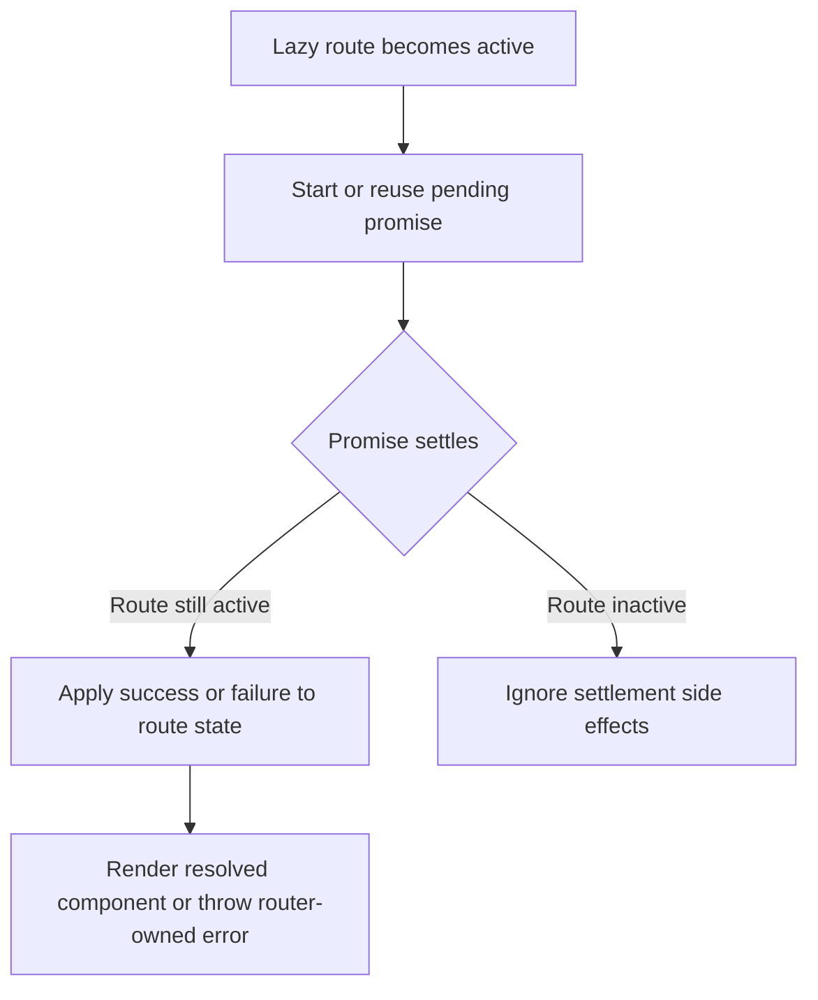

# Inactive Lazy Error Suppression Design

## Goal

Prevent asynchronous lazy-route failures from surfacing after the user has already navigated away from that route.

## Background

Current `Route.svelte` behavior correctly avoids restarting a pending explicit lazy load and validates loader promise shape, but one regression remains:

- if a lazy route starts loading
- the user navigates away before it resolves
- the in-flight load later rejects

the rejection still propagates through `loadError` and is thrown upward even though the route is no longer active.

This means a route the user has already left can still break the current screen.

## Root Cause

The in-flight promise handlers only guard on component destruction.
They do not guard on whether the route is still the active match at the time the promise settles.

As a result:

- success and failure handlers still write into component state after deactivation
- `loadError` can be set for an inactive route
- the later `throw loadError` effect propagates an error unrelated to the current screen

## Decision

Suppress inactive-route lazy completions from mutating render state.

### Desired behavior

- While the route is active, promise resolution and rejection behave normally.
- If the route becomes inactive before the promise settles:
  - success should not render anything immediately
  - failure should not throw into the current screen
- If the user later reactivates the route while the same promise is still pending, the existing in-flight promise should continue to be reused.

## Recommended Approach

Track whether the current route entry is still active at settlement time and ignore settlements that occur after deactivation.

Minimal implementation strategy:

1. Keep the current in-flight promise cache
2. At promise settlement, guard not only on `destroyed`, but also on whether the route is still active
3. Only write:
   - `resolvedComponent`
   - `loadError`
   - `pendingLoad = null`
   when the settlement still belongs to an active route context

## Non-Goals

- Do not redesign the route runtime
- Do not introduce loading UI
- Do not change sync route behavior
- Do not change public `lazyRoute(...)` API

## Runtime Flow

## Testing Strategy

Required regression tests:

1. ` /lazy -> /other ` then reject pending loader:
   - must not throw into the current page
2. Existing tests must continue to pass:
   - pending lazy load does not restart on reactivation
   - non-promise loaders still fail clearly

## Risks

### Hidden stale state

If ignored settlements leave stale pending state forever, later activations could get stuck.

Mitigation:

- clear `pendingLoad` when it settles, even if the route is no longer active, but do not surface success/error into render state

### Lost active error delivery

If the active/inactive guard is too broad, genuinely active route failures could be swallowed.

Mitigation:

- derive the active check from current route match state at settlement time
- keep a regression test that active failures still surface clearly

## Conclusion

The smallest correct fix is to suppress lazy promise side effects after route deactivation while preserving promise reuse and current active-route error semantics.
