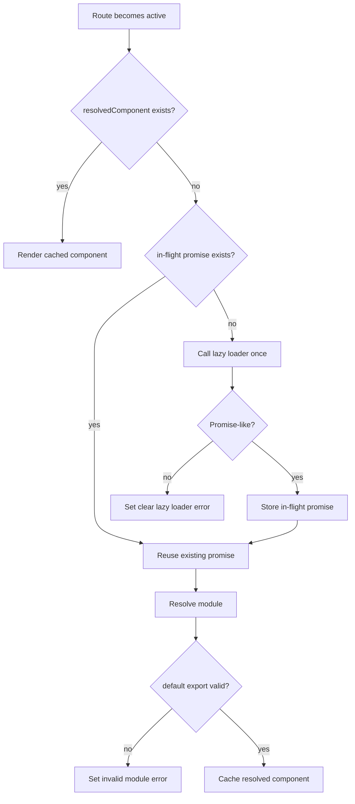

# Lazy Loader Bugfix Design

## Goal

Fix two confirmed regressions in the explicit lazy-route path:

1. pending lazy loads restart when a route becomes inactive and then active again before the first load resolves
2. explicit lazy loaders that do not return a promise fail with a raw runtime `TypeError` instead of a router-owned contract error

## Background

The router now requires explicit lazy definitions via `lazyRoute(...)`.
That removed the old implicit zero-argument probing path, but it introduced two new problems in the explicit branch:

- `Route.svelte` stores the loader function but not the in-flight promise, so reactivation starts a second load
- the explicit lazy path no longer validates that `load()` returns a promise before chaining `.then(...)`

Both issues have been reproduced locally against current `main`.

## Decision

Keep the current explicit `lazyRoute(...)` API and minimally fix the lazy state machine.

## Recommended Approach

### 1. Cache the in-flight lazy promise

When a lazy route becomes active for the first time:

- call `load()` once
- store the returned promise
- reuse that same promise while the route is still unresolved

This preserves the documented behavior that pending lazy loads do not restart when only the query string changes, and extends that guarantee to route deactivation/reactivation before resolution.

### 2. Restore explicit promise validation

Before attaching `.then(...)`:

- call the loader once
- validate the returned value with `isPromiseLike(...)`
- if invalid, set a clear router error like:
  `Lazy route loader must return a promise`

This keeps contract failures inside router-owned error handling instead of leaking raw property-access `TypeError`s.

## Non-Goals

- Do not change the `lazyRoute(...)` public API
- Do not add loading UI
- Do not change sync route behavior
- Do not redesign the whole route runtime around a larger state machine

## Expected File Changes

- Modify: `src/Route.svelte`
- Modify: `tests/route-component.test.ts`
- Modify: `README.md`

## Runtime Flow

## Testing Strategy

Required regression tests:

1. Pending lazy load does not restart after deactivate/reactivate before resolution
2. `lazyRoute(() => null)` throws a clear lazy loader contract error

Existing tests that must keep passing:

- explicit lazy routes render correctly
- query-only navigation does not restart a pending lazy load
- query-only navigation keeps resolved lazy route mounted
- invalid resolved modules still fail clearly

## Risks

### Promise cache lifetime

If the promise cache is never cleared after resolution or rejection, it can keep stale state around longer than needed.

Mitigation:

- clear the in-flight promise once it resolves or rejects
- keep `resolvedComponent` as the steady-state cache after success

### Loader reentrancy

If multiple effects race to call the loader before the promise is stored, duplicate loads can still happen.

Mitigation:

- assign the in-flight promise synchronously before attaching handlers

## Conclusion

The smallest safe fix is to add explicit in-flight promise caching and restore promise-shape validation in the explicit lazy branch.
