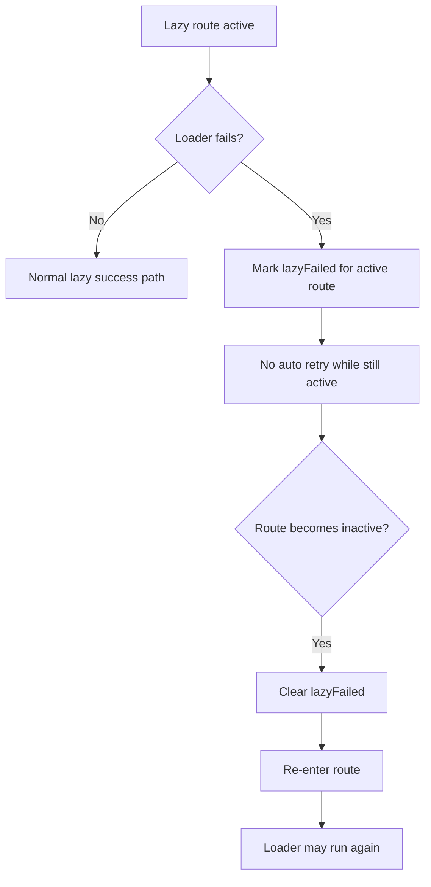

# Lazy Recovery And Anchor Guard Design

## Goal

Address the remaining contract gaps in three focused areas:

1. failed lazy routes should be retryable after the user leaves and re-enters the route
2. `lazyRoute(...)` should enforce the documented zero-argument loader contract at runtime
3. anchor navigation helpers should reject obviously unsafe schemes such as `javascript:`

## Background

The recent lazy-route fixes established these guarantees:

- pending explicit lazy loads are reused
- inactive lazy failures do not crash the current page
- active lazy failures do not automatically retry during the same mount

That last fix intentionally turns failure into a mount-scoped terminal state, but in a typical SPA a route component often stays mounted while only its active state changes.
In practice this means a single transient failure can make the route effectively unrecoverable for the rest of the session.

Separately, two contract gaps remain:

- `lazyRoute(...)` currently accepts any function at runtime, even though README says the loader must be zero-argument
- `getRawAnchorNavigationTarget()` will return `javascript:` targets, which is an unsafe default if anchor interception is later added

## Decision

Keep the current explicit lazy-route API and repair these gaps with minimal runtime checks and state resets.

## Recommended Approach

### 1. Reset mount-scoped lazy failure state on deactivation

Current behavior:

- failure sets a terminal state for the current mounted `Route`
- route deactivation alone does not clear that state

Recommended behavior:

- when a lazy route becomes inactive, clear the mount-scoped lazy failure state
- do not clear it while the route is still active
- keep pending promise reuse unchanged

This gives the user a natural retry path:

- active failure does not loop-retry
- leave route
- re-enter route
- loader is allowed to try again

### 2. Enforce zero-argument loader contract in `lazyRoute(...)`

At creation time, reject loaders whose `length !== 0` with a clear error.
This matches the existing README contract and prevents silent acceptance of malformed loader signatures in JavaScript-only usage.

### 3. Harden raw anchor target filtering

`getRawAnchorNavigationTarget()` should return `null` for non-http(s) absolute schemes such as:

- `javascript:`
- `mailto:`
- `tel:`

The router does not support them as navigation targets, so returning them is an unsafe default.

## Non-Goals

- Do not add configurable retry policies
- Do not add manual retry APIs
- Do not implement anchor interception itself
- Do not broaden router support for non-http(s) schemes

## Runtime Flow

## Testing Strategy

Required new tests:

1. after an active lazy failure, navigating away and back allows a fresh retry
2. `lazyRoute((arg) => import(...))` fails with a clear zero-argument contract error
3. `getRawAnchorNavigationTarget()` returns `null` for `javascript:` (and optionally other unsupported schemes)

Existing tests that must remain green:

- pending loads do not restart on query change
- pending loads do not restart on deactivate/reactivate before resolution
- inactive failures do not throw into the current page
- active failures do not auto-retry while still active

## Risks

### Resetting too much on deactivation

If deactivation clears more than the failure flag, it could accidentally restart pending loads or forget resolved components.

Mitigation:

- only clear the mount-scoped failure state
- keep pending promise and resolved component behavior unchanged

### Over-filtering anchor targets

If filtering is too broad, valid same-origin absolute URLs could be dropped.

Mitigation:

- only reject clearly unsupported schemes
- keep `/path`, `?query`, and same-origin `https://...` behavior unchanged

## Conclusion

The smallest safe improvement is to:

- clear lazy failure state when a route becomes inactive
- validate zero-argument loader shape in `lazyRoute(...)`
- reject unsafe non-http(s) raw anchor targets
