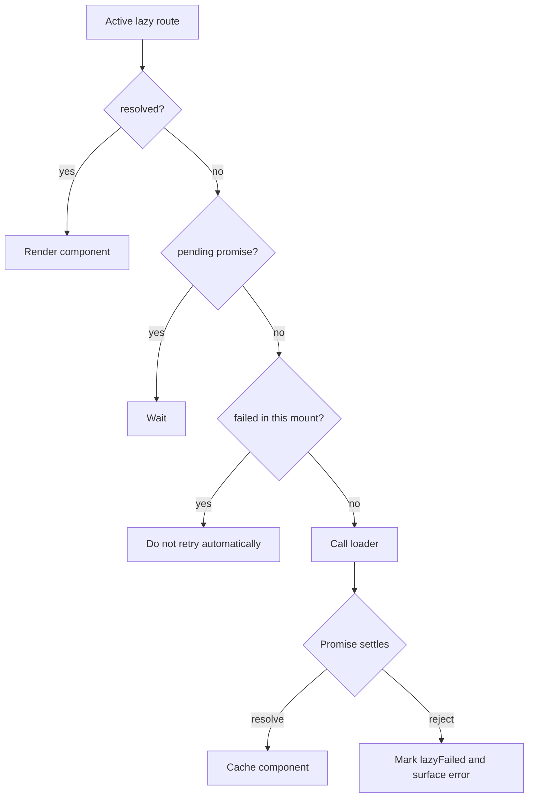

# Lazy Retry Stop Design

## Goal

Stop explicit lazy routes from automatically retrying failed loaders while the route remains mounted and active.

## Background

Current behavior after recent lazy-route fixes:

- pending lazy loads are reused
- inactive-route failures no longer crash the current page
- invalid non-promise loaders throw a clear contract error

But one issue remains:

- if an active lazy route loader rejects
- and the surrounding app catches the thrown error rather than tearing down the route
- the route clears `pendingLoad`
- the next effect pass calls the loader again

That creates implicit retries without any explicit retry policy.

## Root Cause

The lazy branch uses:

- `pendingLoad` to avoid duplicate concurrent calls
- `loadError` to surface the failure upward

But after rejection:

- `pendingLoad` is cleared
- `loadError` is reset on the next effect cycle
- there is no stable failure terminal state

So the route returns to a state indistinguishable from “not loaded yet”.

## Decision

Treat lazy loader failure as a terminal state for the current `Route` mount.

## Desired Behavior

- First failure should surface clearly through the router error path
- After that failure, the same mounted route should not automatically call the loader again
- A fresh mount of the route may try again normally

## Recommended Approach

Introduce a small mount-scoped failure flag in `Route.svelte`, for example:

- `lazyFailed = false` initially
- set `lazyFailed = true` when an active lazy load rejects or returns an invalid loader result
- prevent the lazy effect from calling the loader again while `lazyFailed` is true

This is smaller and clearer than adding configurable retry semantics.

## Non-Goals

- Do not add automatic retry
- Do not add manual retry API
- Do not change `lazyRoute(...)` public API
- Do not redesign the route runtime

## Runtime Flow

## Testing Strategy

Required regression test:

1. Active lazy loader failure is not automatically retried during the same mount

Existing guarantees that must stay green:

- pending lazy loads do not restart on query changes
- pending lazy loads do not restart on deactivate/reactivate before resolution
- inactive lazy failures do not crash the current page
- non-promise loaders still fail clearly

## Conclusion

The smallest safe fix is to add an explicit mount-scoped lazy failure state and block automatic re-entry into the loader once that state is reached.
