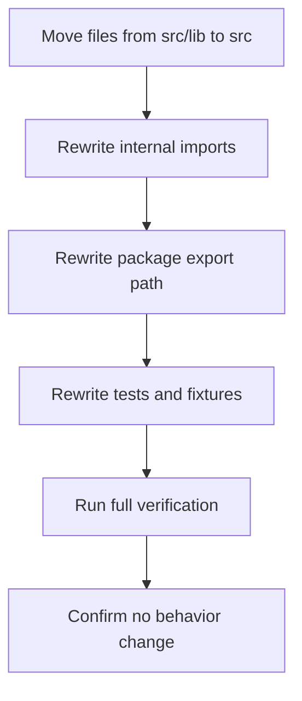

# `src/lib` To `src` Flattening Design

## Goal

Flatten the library source layout from `src/lib/*` to `src/*` without changing runtime behavior, public API behavior, or package semantics.

## Background

The current project is small and nearly all production source files live under `src/lib/`.
That extra `lib` layer adds path noise without providing a strong architectural boundary.

Current rough shape:

- `src/lib/*` contains the router runtime and public entry
- `src/*.d.ts` contains source-adjacent declarations
- `tests/*` imports source files through `src/lib/...`

For this repository, keeping `src` as the source boundary still makes sense, but keeping `lib` underneath it is no longer pulling its weight.

## Decision

Flatten production source files from:

- `src/lib/index.ts`
- `src/lib/Route.svelte`
- `src/lib/history.ts`
- `src/lib/navigation.ts`
- `src/lib/query.ts`
- `src/lib/router.svelte.ts`
- `src/lib/route-validation.ts`
- `src/lib/types.ts`
- `src/lib/lazy.ts`

to:

- `src/index.ts`
- `src/Route.svelte`
- `src/history.ts`
- `src/navigation.ts`
- `src/query.ts`
- `src/router.svelte.ts`
- `src/route-validation.ts`
- `src/types.ts`
- `src/lazy.ts`

Keep the declaration files where they are:

- `src/app.d.ts`
- `src/jsdom.d.ts`
- `src/bun-test.d.ts`

## Non-Goals

- Do not change runtime behavior
- Do not change the public import shape (`import { Route } from 'svelte-route'`)
- Do not change test semantics
- Do not mix unrelated refactors into the same change
- Do not move source files into the repository root

## Architecture Rationale

### Why flatten to `src/` instead of repository root

`src` is still a useful source boundary because this repository already keeps source-adjacent declarations there.
Moving runtime files to the repository root would mix package metadata, docs, tests, and production code in one layer.

Flattening to `src/` preserves a clean split:

- root: package metadata, config, docs, tests
- `src/`: production source and source-adjacent declarations

### Why remove `lib`

At the current repository size, `lib` does not express an important architectural subdivision.
It mostly adds longer paths in:

- public export metadata
- test fixture imports
- local source imports

Removing it lowers path depth without weakening module boundaries.

## Expected File Changes

### Production source moves

- `src/lib/index.ts` -> `src/index.ts`
- `src/lib/Route.svelte` -> `src/Route.svelte`
- `src/lib/history.ts` -> `src/history.ts`
- `src/lib/navigation.ts` -> `src/navigation.ts`
- `src/lib/query.ts` -> `src/query.ts`
- `src/lib/router.svelte.ts` -> `src/router.svelte.ts`
- `src/lib/route-validation.ts` -> `src/route-validation.ts`
- `src/lib/types.ts` -> `src/types.ts`
- `src/lib/lazy.ts` -> `src/lazy.ts`

### Metadata updates

- `package.json` export target changes from `./src/lib/index.ts` to `./src/index.ts`

### Test updates

All direct file-path imports in tests and fixtures need to move from `src/lib/...` to `src/...`.

### Documentation updates

Any source-path references in docs should be updated to the flattened layout when they are still relevant.

## Migration Strategy

This change should be treated as a pure path migration.

Recommended sequence:

1. Move source files from `src/lib` to `src`
2. Update intra-source relative imports
3. Update `package.json` export paths
4. Update tests, fixtures, and helper imports
5. Update docs only where they mention old source paths
6. Run full verification

## Runtime Flow Impact

There should be no runtime flow change.
Only file locations and import paths change.

## Risks

### 1. Broken relative imports

The main operational risk is missing one or more path rewrites after moving files.

Mitigation:

- perform the move first, then systematically update imports
- rely on `bun test` and `bun run typecheck`

### 2. Stale hard-coded test paths

Some tests compile or import source files directly by path.

Mitigation:

- search for all `src/lib/` references before finishing

### 3. Hidden doc drift

Some plan/spec files may mention `src/lib`.

Mitigation:

- only update docs that are still intended to be current and user-facing
- avoid churning archival docs unnecessarily unless they are part of the active design set

## Verification Strategy

Required verification:

- `rg "src/lib/" .`
- `bun test`
- `bun run typecheck`

Success criteria:

- no remaining active source/test references to `src/lib/`
- package export points to `src/index.ts`
- tests pass unchanged in behavior
- typecheck remains clean

## Conclusion

Flattening `src/lib` to `src` is a reasonable cleanup for this repository.

### Facts

- the project is small
- production code is concentrated in one subtree
- `src` already serves as the real source boundary

### Assumptions

- this work is intended as structural cleanup, not behavior change
- preserving public package imports matters more than preserving internal file paths

### Recommendation

Proceed only as a dedicated, behavior-neutral refactor: `src/lib/*` -> `src/*`, nothing more.
